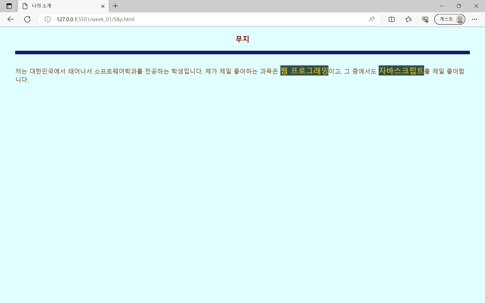
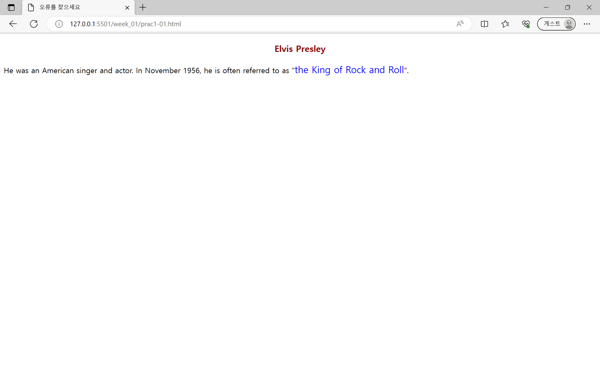
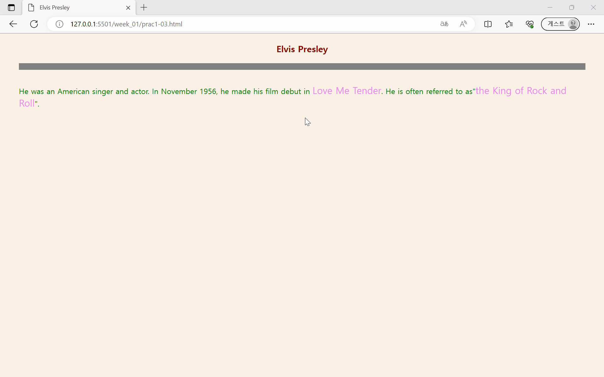
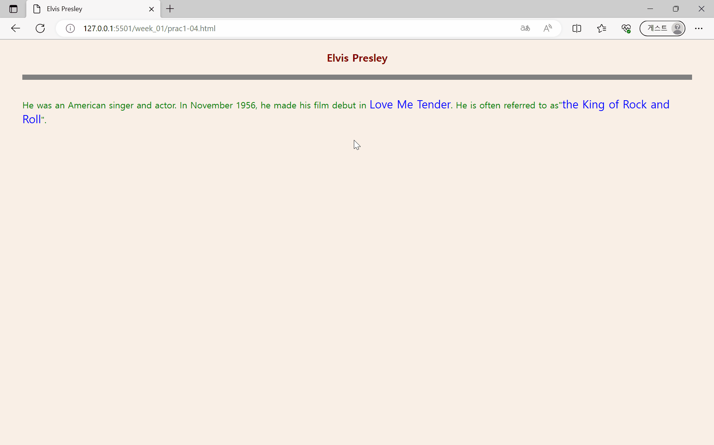

# 1주차 과제
## chap 01 - 웹 프로그래밍과 HTML5 개요
### [Open Challenge 01](./58p.html)

- HTML, CSS, JS를 이용한 페이지 꾸미기

### 실습과제
#### [1번](./prac1-01.html)

- [HTML, CSS, JS 문법 오류 찾기](./58p.md)

#### [2번](./prac1-02.html)

- [HTML, CSS, JS 문법 오류 찾기](./58p.md)

#### [3번](./prac1-03.html)

- CSS로 HTML 태그 스타일 수정하기

#### [4번](./prac1-04.html)

- span 태그에 마우스를 올리면 사진 출력하기

