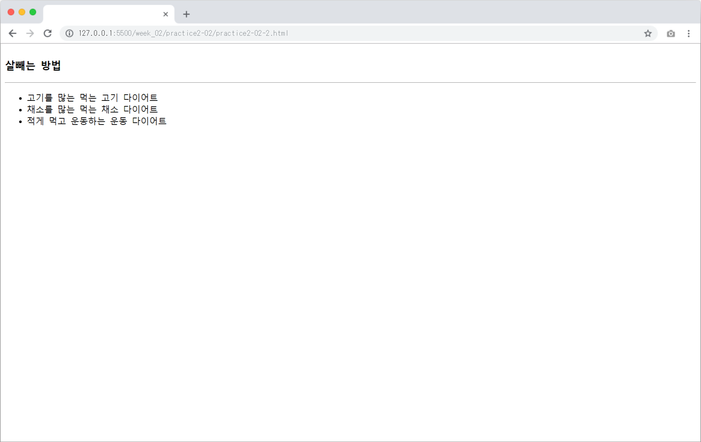
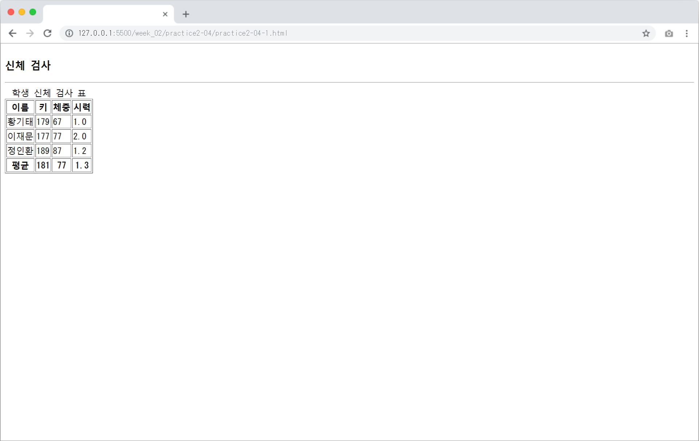

# 2주차 과제
## Open Challenge 02

* 구현 기능
    * 오디오
        * 오디오 컨트롤러 표시
        * 오디오 자동 재생
    * 링크
        * 앵커로 이동
        * 웹 페이지로 이동
    * 이미지
    * 목록

## 실습과제
### 1번

* 구현 기능
    * `<H>`태그
    * `
`태그
    * `<pre>`태그로 원래 문장 그대로 표시하기

### 2번

* 구현 기능
    * `<dl>`, `<dt>`, `<dd>` 태그를 이용한 정의 리스트 만들기

* 구현 기능
    * `<ul>` 태그를 이용한 리스트 만들기

### 3번

* 구현 기능
    * `<table>` 태그를 이용한 이미지 나열
    * `<caption>` 태그로 추가 설명

### 4번

* 구현 기능
    * `<table>`, `<thead>`, `<tfoot>`, `<tbody>` 를 사용한 표 전체 구성

* 구현 기능
    * `<table>`의 `border` 속성을 사용하여 표 테두리 표시

### 5번

* 구현 기능
    * `<a>` 태그의 `target`속성
        * `_blank`를 이용한 새 창에서 연결된 페이지 열기

### 6번

* 구현 기능
    * `<iframe>` 의 `name` 속성 값을 왼쪽 `<iframe>`의 원본 파일에서 `target` 속서으로 사용
        * 왼쪽 `<iframe>`의 링크를 누르면 오른쪽 `<iframe>`에 페이지가 표시됨

### 7번

* 구현 기능
    * `<audio>` 태그를 이용한 오디오 파일 재생

### 8번

* 구현 기능
    * `<video>` 태그를 이용한 영상 파일 재생

