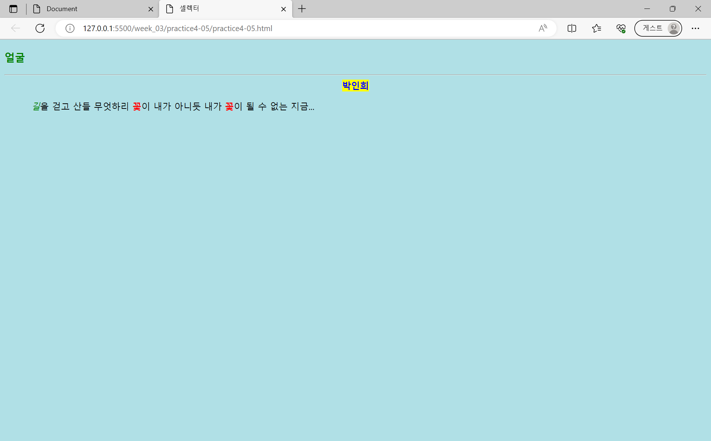
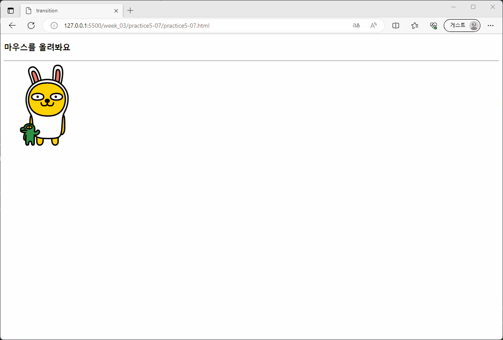
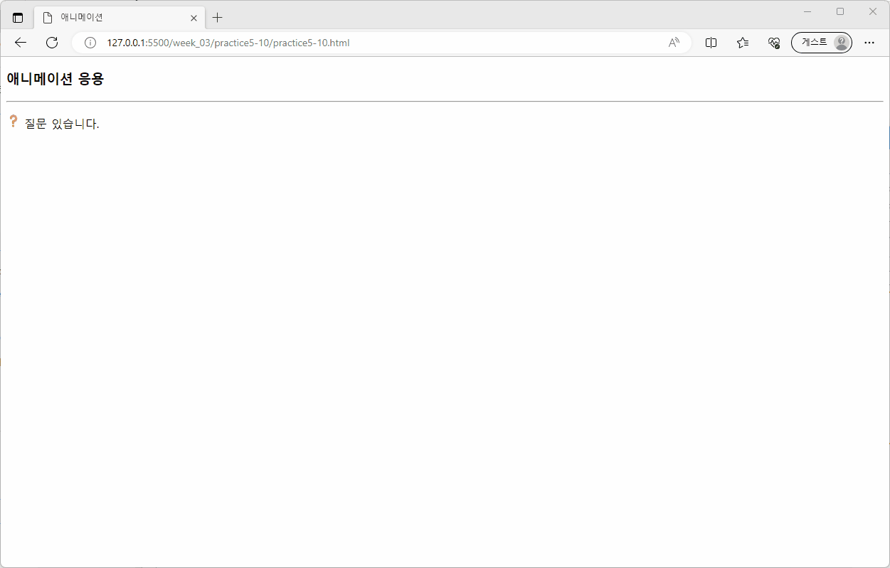

# 3주차 과제
## [셀렉터 활용 예제](./week_03/selector_example/selector_example.html)

* 구현 기능
    * 셀렉터
        * 태그 이름 셀렉터
            * 태그 이름을 콤마로 구분하여 여러 태그에 같은 스타일 지정
        * 자식 셀렉터
            * `>`
        * 자손 셀렉터
            * ` `(공백으로 구분)
        * class 셀렉터
            `.`
        * id 셀렉터
            `#`
        * 가상 클래스 셀렉터
            * `:first-letter` -> 제목(`Web Programming`)의 맨 첫 글자만 색상 변경
            * `:hover` -> 마우스 이동 시 배경 색상이 바뀜

---

## [About page](./aboutPage/index.html)

* 애니메이션을 활용한 About Page 만들기

---

## Chap 04
### [Open Challenge 04](./OpenChallenge04/OpenChallenge04.html)

* 텍스트 꾸미기, header, footer 꾸미기

### 실습과제
#### [1번](./practice4-01/practice4-01.html)

* 태그 셀렉터 만들기

#### [2번](./practice4-02/practice4-02.html)

* 텍스트 꾸미기

#### [3번](./practice4-03/practice4-03.html)

* 색 테이블 만들기

#### [4번](./practice4-04/practice4-04.html)

* 셀렉터 만들기

#### [5번](./practice4-05/practice4-05.html)

* 셀렉터 만들기

#### [6번](./practice4-06/practice4-06.html)

* 링크 꾸미기, `:hover`

#### [7번](./practice4-07/practice4-07.html)

* `:hover` 활용

#### [8번](./practice4-08/practice4-08.html)

* 이미지 테두리 만들기

#### [9번](./practice4-09/practice4-09.html)

* `text-shadow`와 `box-shadow`

---

## Chap 05
### [Open Challenge 05](./OpenChallenge05/OpenChallenge05.html)

* header, nav, section, footer 구역 별로 꾸미기

### 실습과제
#### [1-1번](./practice5-01/practice5-01-1.html)

#### [1-1번](./practice5-01/practice5-01-2.html)

* div 활용

#### [2번](./practice5-02/practice5-02.html)

* `positon: piexed` 속성

#### [3번](./practice5-03/practice5-03.html)

* 리스트, 버튼 활용

#### [4-1번](./practice5-04/practice5-04-1.html)

#### [4-2번](./practice5-04/practice5-04-2.html)

* 리스트 만들기

#### [5번](./practice5-05/practice5-05.html)

* float 배치

#### [6-1번](./practice5-06/practice5-06-1.html)

#### [6-2번](./practice5-06/practice5-06-2.html)

* 애니메이션 만들기

### [7번](./practice5-07/practice5-07.html)

* 애니메이션 `:hover` 활용

### [8번](./practice5-08/practice5-08.html)

* 리스트로 수직 메뉴 만들기

### [9번](./practice5-09/practice5-09.html)

* 리스트 꾸미기, 마커 제거

### [10번](./practice5-10/practice5-10.html)

* 애니메이션 응용