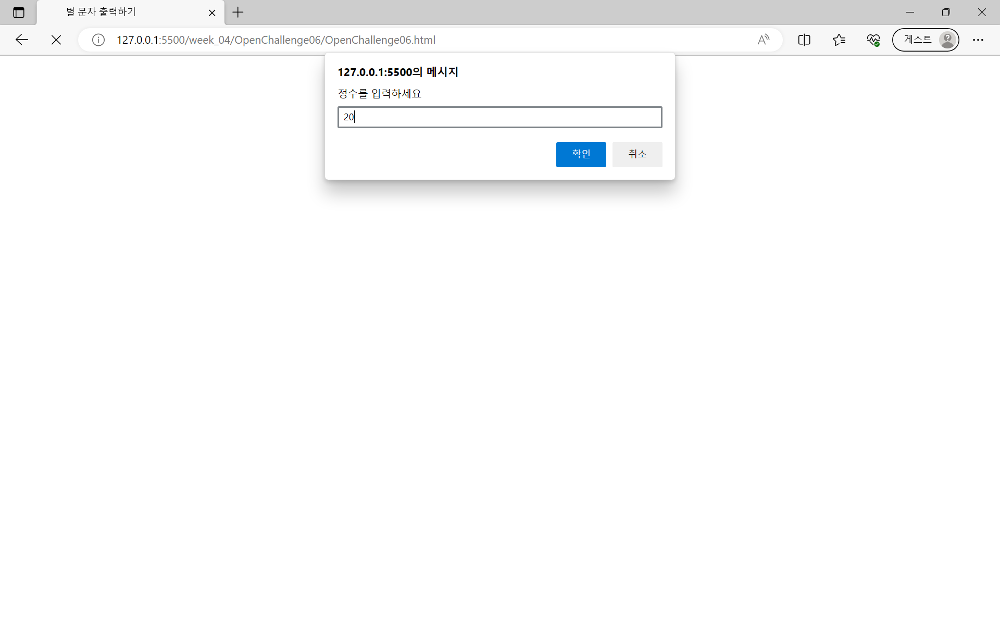
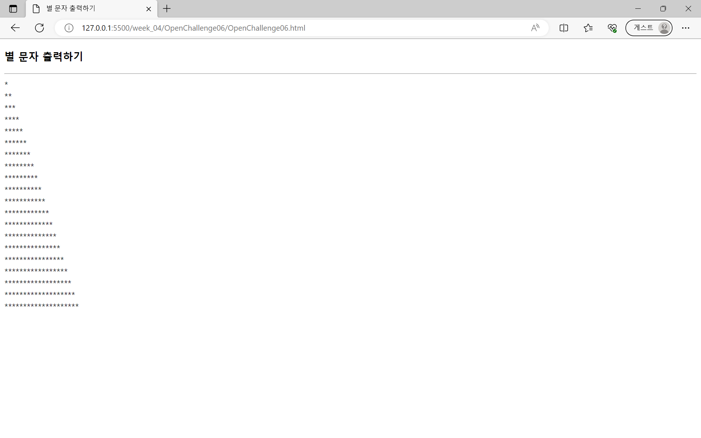
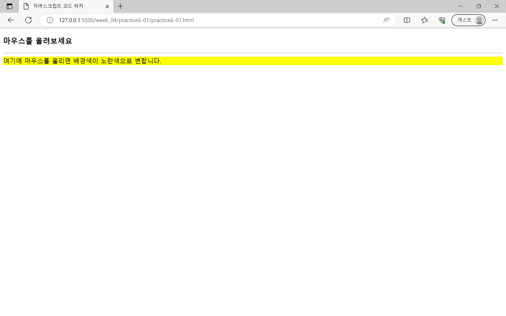
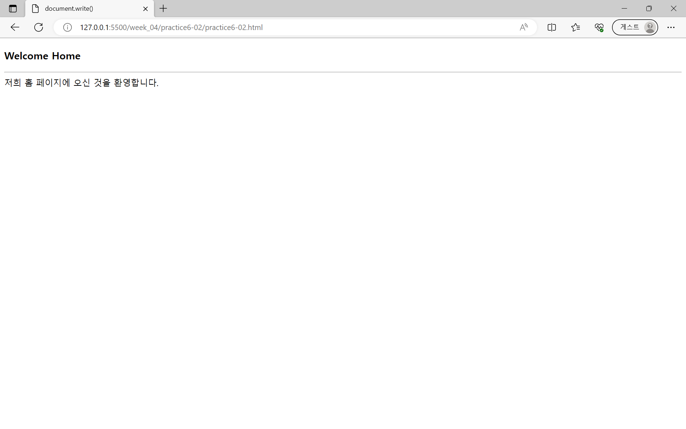
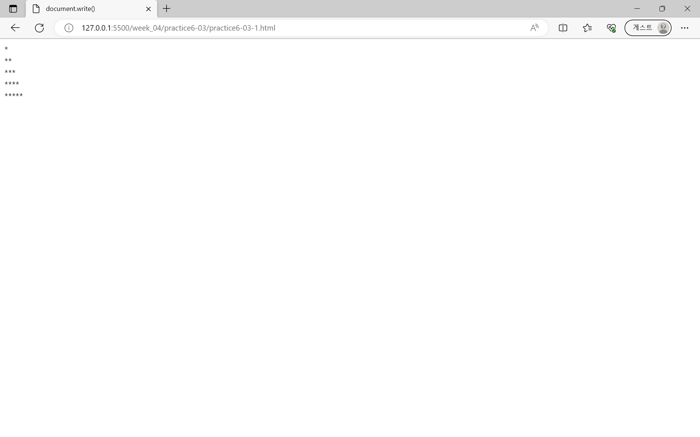
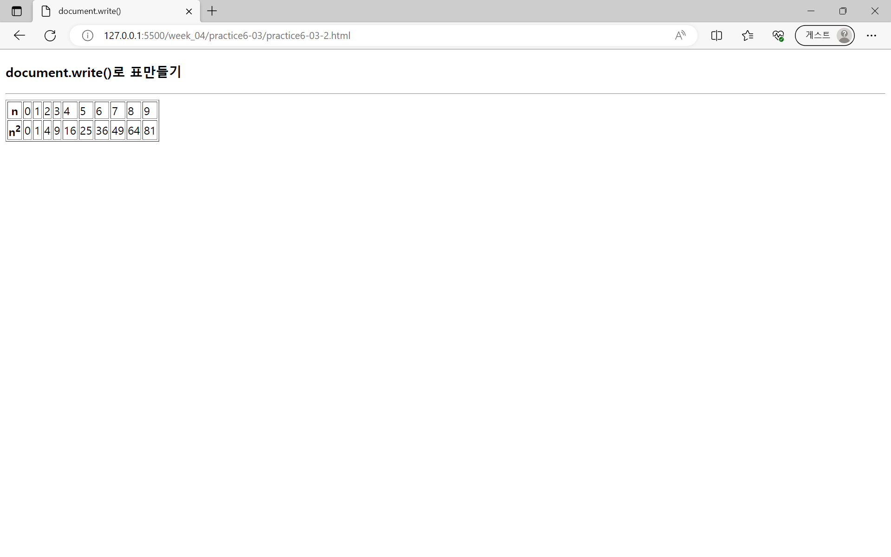
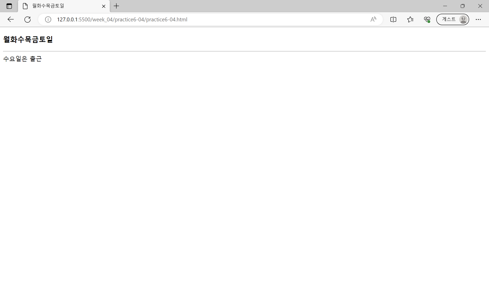
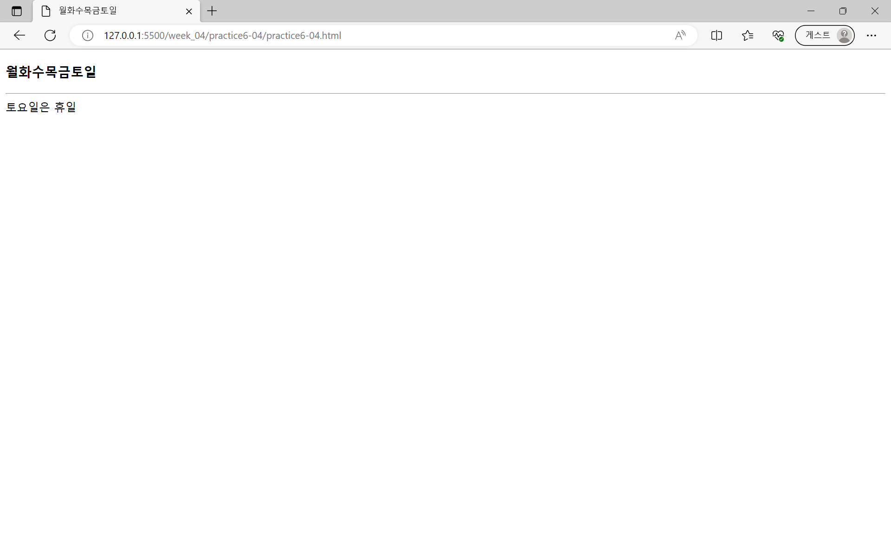

# 4주차 과제
## chap 06 - 자바스크립트 언어
### [Open Challenge 06](./OpenChallenge06/OpenChallenge06.html)
|  |  |
|---|---|
| | |

### 실습과제
#### 1번

- [1번-1](./practice6-01/practice6-01.html)
- [1번-2](./practice6-01/practice6-02.html)

#### [2번](./practice6-02/practice6-02.html)

#### [3-1번](./practice6-03/practice6-03-1.html)

#### [3-2번](./practice6-03/practice6-03-2.html)

#### [4번](./practice6-04/practice6-04.html)

#### [3-2번](./practice6-03/practice6-03-2.html)

## chap 07 - 자바스크립트 코어 객체와 배열
