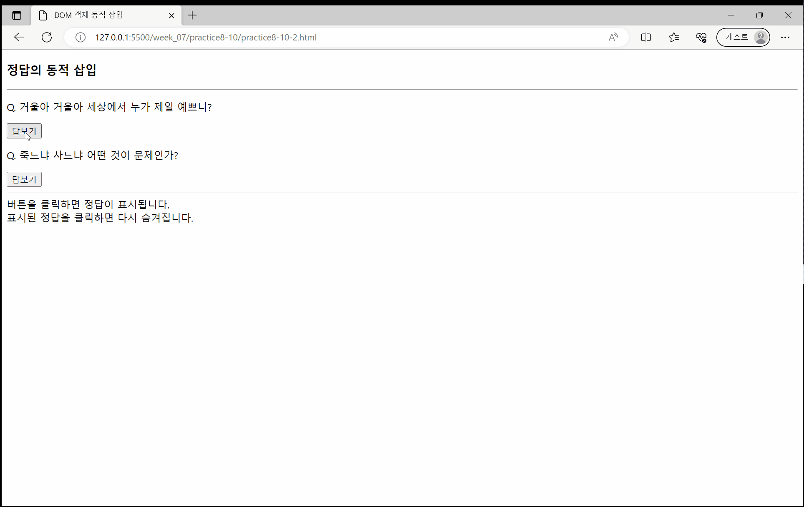

# 7주차 과제

## chap 08 - HTML DOM과 Document

### [Open Challenge 08](./OpenChallenge08/OpenChallenge08.html)

### 실습과제
#### 1번
- [1-1번](./practice8-01/practice8-01-1.html)

- [1-2번](./practice8-01/practice8-01-2.html)

- [1-3번](./practice8-01/practice8-01-1.html)

#### 2번
- [2-1번](./practice8-02/practice8-02-1.html)

- [2-2번](./practice8-02/practice8-02-2.html)

- [2-3번](./practice8-03/practice8-03.html)

#### [3번](./practice8-03/practice8-03.html)

#### [4번](./practice8-04/practice8-04.html)

#### [5번](./practice8-05/practice8-05.html)

#### [6번](./practice8-06/practice8-06.html)

#### 7번
- [7-1번](./practice8-07/practice8-07-1.html)

- [7-2번](./practice8-07/practice8-07-2.html)

#### [8번](./practice8-08/practice8-08.html)

#### [9번](./practice8-09/practice8-09.html)

#### 10번
- [10-1번](./practice8-10/practice8-10-1.html)

- [10-2번](./practice8-10/practice8-10-2.html)

---

## chap 09 - 이벤트 기초 및 활용

### [Open Challenge 09](./OpenChallenge09/OpenChallenge09.html)

### 실습과제
#### [1번](./practice9-01/practice9-01.html)

#### [2번](./practice9-02/practice9-02.html)

#### [3번](./practice9-03/practice9-03.html)

#### [4번](./practice9-04/practice9-04.html)

#### [5번](./practice9-05/practice9-05.html)

#### [6번](./practice9-06/practice9-06.html)

#### [7번](./practice9-07/practice9-07.html)

#### [8번](./practice9-08/practice9-08.html)

#### [9번](./practice9-09/practice9-09.html)

#### [10번](./practice9-10/practice9-10.html)

