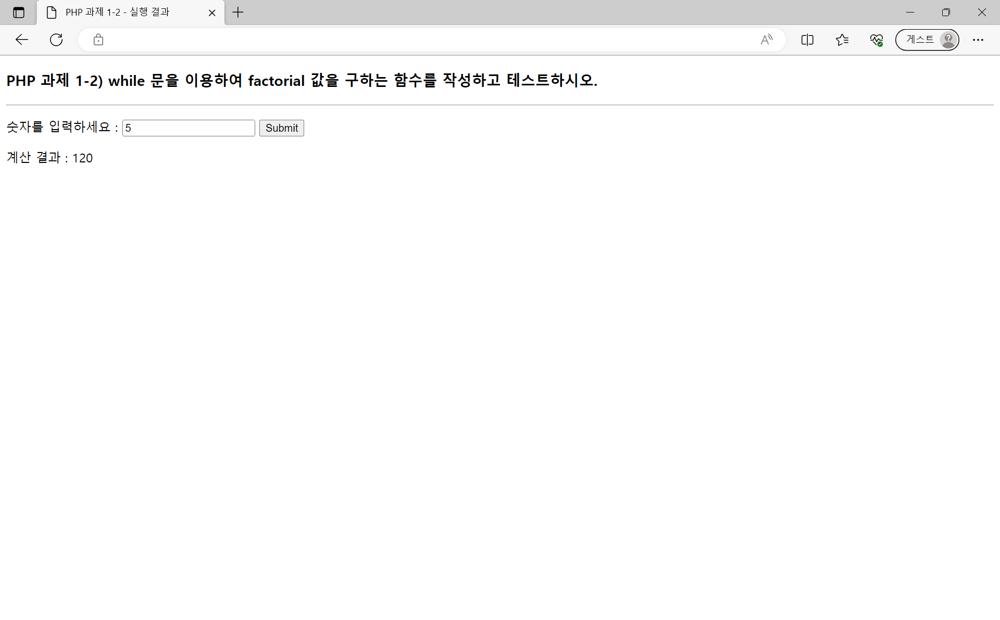

# 10주차 과제
## ToC
* [이론 문제](#php-이론-문제)
    * 1
    * 2
    * 3
    * 4
    * 5
* [실습 문제](#php-실습-문제)
    * 1
    * 2
    * 3

## PHP 이론 문제

### 1. 동적 웹페이지와 정적 웹페이지의 차이를 설명하시오.  

정적 웹페이지와 동적 웹페이지는 사용자의 웹 브라우저에서 요청한 페이지를 서버가 제공해주는 방법에서 차이점이 있습니다.

**정적 웹 페이지**는 서버에 미리 저장된 HTML, CSS, JavaScript 등의 파일에서 요청된 페이지를 찾아서 그대로 클라이언트에게 전달하는 방식입니다. 따라서 사용자의 요청에 따라 웹페이지의 내용이 변경되지 않습니다. 
일반적으로 회사 소개, 제품 소개, FAQ 등의 페이지 등에 주로 구현되는 방식입니다.

**동적 웹 페이지**는 웹 서버에서 생성되며, 데이터베이스와 같은 외부 데이터 소스에서 정보를 가져와서 페이지를 생성합니다. 이러한 페이지는 사용자가 페이지를 요청할 때마다 생성되며, 사용자가 페이지를 요청하는 시점에 따라 다른 콘텐츠를 표시할 수 있습니다.
일반적으로 게시판, 블로그, 온라인 쇼핑몰 사이트 등에 구현되는 방식입니다.

### 2. PHP에 설치된 모듈(20개)은 어떤 것이 있는지 조사하시오.  

| #   | 모듈 이름 | 설명 |
| --- | --------- | ---- |
| 1. | **PDO** | 데이터베이스에 연결하고 데이터를 가져오는 데 사용됩니다. |
| 2. | **cURL** | URL을 가져오고 보내는 데 사용됩니다. |
| 3. | **GD** | 이미지를 생성하고 편집하는 데 사용됩니다. |
| 4. | **JSON** | JSON 데이터를 생성하고 구문 분석하는 데 사용됩니다. |
| 5. | **XML** | XML 데이터를 생성하고 구문 분석하는 데 사용됩니다. |
| 6. | **Session** | 사용자 세션을 관리하는 데 사용됩니다. |
| 7. | **SimpleXML** | XML 데이터를 쉽게 구문 분석하는 데 사용됩니다. |
| 8. | **DOM** | XML 및 HTML 문서를 구문 분석하고 조작하는 데 사용됩니다. |
| 9. | **SOAP** | 웹 서비스를 작성하고 호출하는 데 사용됩니다. |
| 10. |**Zip** | ZIP 파일을 생성하고 압축을 해제하는 데 사용됩니다. |
| 11. | **mbstring** | 멀티바이트 문자열을 다루는 데 사용됩니다. |
| 12. | **iconv** | 문자 인코딩 변환을 수행하는 데 사용됩니다. |
| 13. | **mysqli** | MySQL 데이터베이스에 연결하고 데이터를 가져오는 데 사용됩니다. |
| 14. | **openssl** | SSL 및 TLS 프로토콜을 사용하여 암호화를 수행하는 데 사용됩니다. |
| 15. | **ftp** | FTP 서버와 통신하는 데 사용됩니다. |
| 16. | **imagick** | 이미지를 생성하고 편집하는 데 사용됩니다. |
| 17. | **exif** | JPEG 및 TIFF 이미지의 메타데이터를 읽고 쓰는 데 사용됩니다. |
| 18. | **bcmath** | 임의 정밀도 산술 연산을 수행하는 데 사용됩니다. |
| 19. | **gettext** | 다국어 지원을 위한 문자열 번역을 수행하는 데 사용됩니다. |
| 20. | **ziparchive** | ZIP 파일을 생성하고 압축을 해제하는 데 사용됩니다. |

### 3. PHP에서 사용되는 스크립트 엔진에 대해 기술하시오.  

PHP는 Zend Engine이라는 스크립트 엔진을 사용합니다. 
Zend Engine은 PHP의 기본 엔진이며, PHP 스크립트를 빠르게 처리할 수 있도록 최적화되어 있습니다.
PHP 코드를 실행하는 데 필요한 기능인 파싱, 컴파일, 실행과 같은 기능을 제공합니다.

PHP 스크립트는 메모리에 로드되고 파싱 단계를 거쳐 Zend opcodes로 컴파일됩니다. 이러한 opcodes를 실행하고 생성된 HTML이 클라이언트로 전송됩니다

### 4. 웹 브라우저에서 `http://www.abc.com/abc.php` 페이지를 접속했을 때, 서버는 어떠한 일을 수행하는가?  

웹 브라우저에서 보낸 HTTP 요청을 수신합니다.
요청한 페이지의 위치를 확인하고 그 페이지가 정적 웹페이지인지, 동적 웹페이지인지 확인합니다.
* 정적 웹페이지인 경우, 페이지의 내용을 그대로 클라이언트에게 전송합니다.
* 동적 웹페이지인 경우, 페이지의 내용을 생성하여 클라이언트에게 전송합니다.

### 5. call by value와 call by reference의 차이점에 대해 기술하시오.  

PHP에서 함수의 호출 방식이 크게 call by value와 call by reference의 두 가지 방식으로 구분됩니다.

**call by value** 방식은 함수에 전달되는 인수의 값을 복사하여 함수 내부에서 사용합니다. 따라서 함수 내부에서 인수의 값을 변경하더라도 원본 인수의 값은 변경되지 않습니다.
* 일반적으로 call by reference 방식보다 빠른 성능
* 원본 인수의 값이 변경되지 않으므로, 안전

**call by reference** 방식은 함수에 전달되는 인수의 참조를 전달하여 함수 내부에서 사용합니다. 따라서 함수 내부에서 인수의 값을 변경하면 원본 인수의 값도 변경됩니다.
* 원본 인수의 값을 변경할 수 있으므로, 더 복잡한 동작을 수행 가능
* call by value 방식보다 성능이 느리고, 원본 인수의 값이 변경될 수 있으므로 안전하지 않음

---

## PHP 실습 문제
### 1. `$a`라는 변수의 값이 홀수이면 그 숫자 다음 숫자인 짝수를 출력하고, `$a`의 값이 짝수이면 그 수를 출력하는 함수를 작성하고 테스트하시오.  
* [코드](./hw1-1/hw1-1.php)
* [완성 페이지](https://web23php.seoftbh.repl.co/hw1/hw1-1/hw1-1.php)

| 홀수(`5`)를 입력한 경우 | 짝수(`6`)를 입력한 경우 |
|-----------------------|-----------------------|
|  |  |

### 2. `while`문을 이용하여 `factorial` 값을 구하는 함수를 작성하고 테스트하시오.  
* [코드](./hw1-2/hw1-2.php)
* [완성 페이지](https://web23php.seoftbh.repl.co/hw1/hw1-2/hw1-2.php)

### 3. 다음 프로그램과 동일한 기능을 하는 프로그램을 삼항연산자`( ? : )`를 이용하여 작성과 테스트하시오.  
* [코드](./hw1-3/hw1-3.php)
* [완성 페이지](https://web23php.seoftbh.repl.co/hw1/hw1-3/hw1-3.php)

