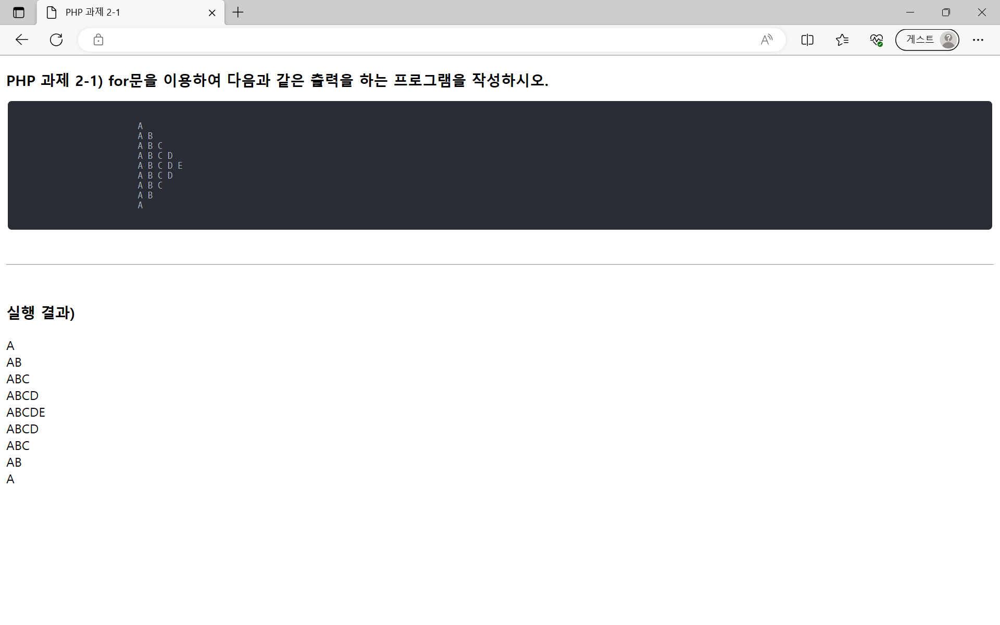
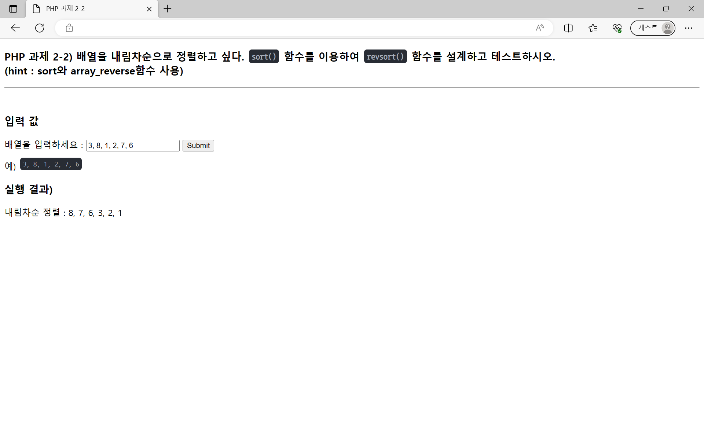
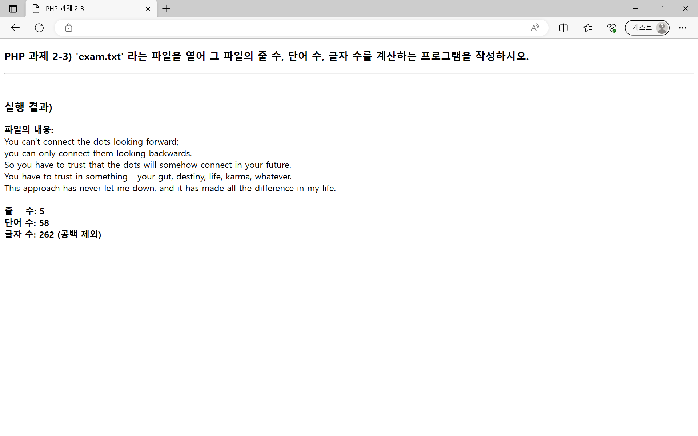
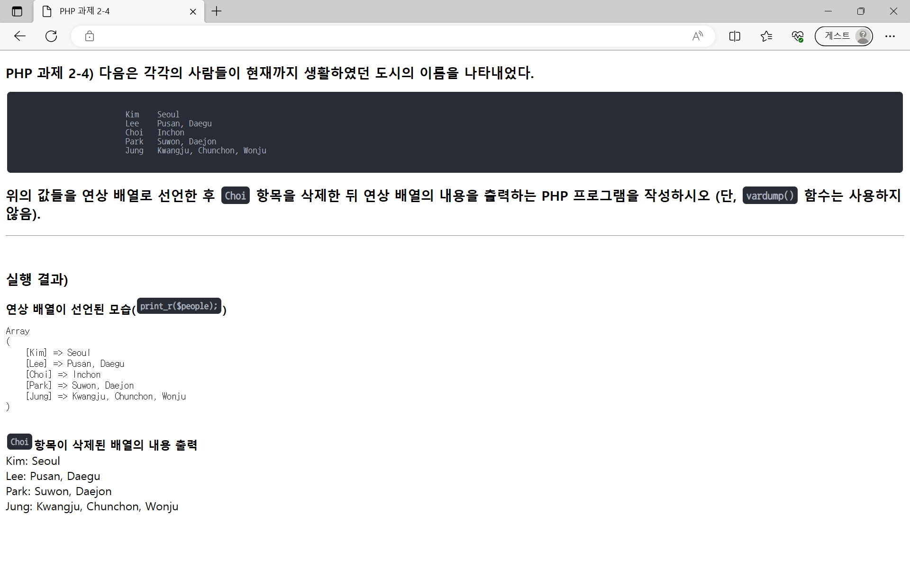
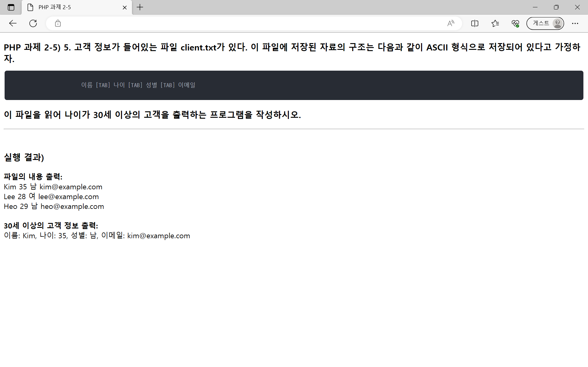

# 10주차 과제
## ToC
* [실습 문제](#php-실습-문제)
    * 1
    * 2
    * 3
    * 4
    * 5


## PHP 실습 문제
### 1. for문을 이용하여 다음과 같은 출력을 하는 프로그램을 작성하시오.  
```
A  
A B  
A B C  
A B C D  
A B C D E   
A B C D  
A B C  
A B  
A 
``` 
* [코드](./hw2-1/hw2-1.php)
* [완성 페이지](https://web23php.seoftbh.repl.co/hw2/hw2-1/hw2-1.php)




### 2. 배열을 내림차순으로 정렬하고 싶다. sort() 함수를 이용하여 revsort() 함수를 설계하고 테스트하시오.  
> (hint : sort와 array_reverse함수 사용)  
* [코드](./hw2-2/hw2-2.php)
* [완성 페이지](https://web23php.seoftbh.repl.co/hw2/hw2-2/hw2-2.php)




### 3. 'exam.txt' 라는 파일을 열어 그 파일의 줄 수, 단어 수, 글자 수를 계산하는 프로그램을 작성하시오.  
* [코드](./hw2-3/hw2-3.php)
* [완성 페이지](https://web23php.seoftbh.repl.co/hw2/hw2-3/hw2-3.php)




### 4. 다음은 각각의 사람들이 현재까지 생활하였던 도시의 이름을 나타내었다.  
```
Kim    Seoul  
Lee    Pusan, Daegu  
Choi   Inchon  
Park   Suwon, Daejon  
Jung   Kwangju, Chunchon, Wonju  
```
### 위의 값들을 연상 배열로 선언한 후 Choi 항목을 삭제한 뒤 연상 배열의 내용을 출력하는 PHP 프로그램을 작성하시오 (단, vardump() 함수는 사용하지 않음).  
* [코드](./hw2-4/hw2-4.php)
* [완성 페이지](https://web23php.seoftbh.repl.co/hw2/hw2-4/hw2-4.php)




### 5. 고객 정보가 들어있는 파일 client.txt가 있다. 이 파일에 저장된 자료의 구조는 다음과 같이 ASCII 형식으로 저장되어 있다고 가정하자.  
```
이름 [TAB] 나이 [TAB] 성별 [TAB] 이메일
```
### 이 파일을 읽어 나이가 30세 이상의 고객을 출력하는 프로그램을 작성하시오.
* [코드](./hw2-5/hw2-5.php)
* [완성 페이지](https://web23php.seoftbh.repl.co/hw2/hw2-5/hw2-5.php)


