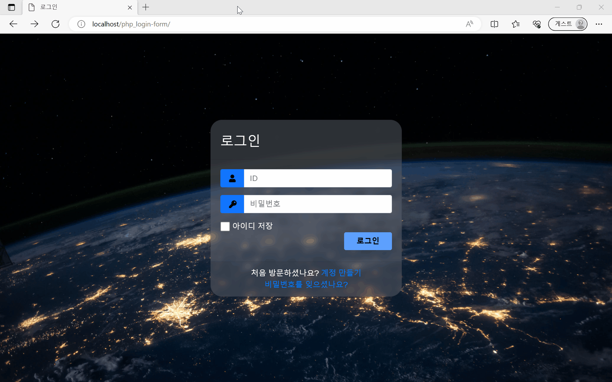

# 12주차 과제
## ToC
- [PHP 로그인 폼 구현](#php-로그인-폼-구현)

## PHP 로그인 폼 구현
- 코드
    - [로그인 페이지 (HTML)](./php_login-form/php_login-form.html)
    - [로그인 결과 페이지 (PHP)](./php_login-form/welcome.php)
- [완성 페이지](https://web23php.seoftbh.repl.co/php_login-form/php_login-form.html)

---

