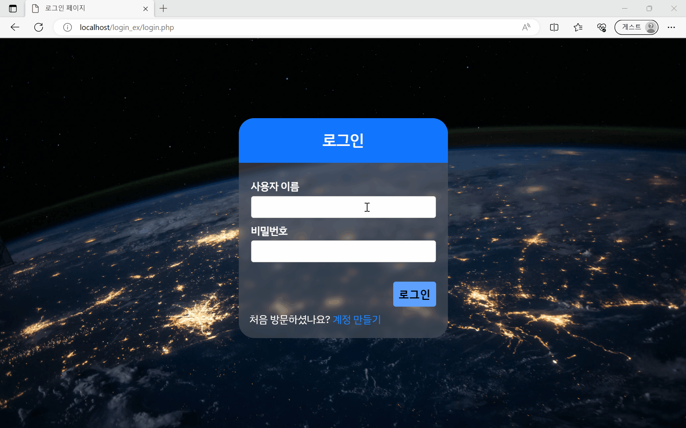

# 13주차 과제
## ToC
- [데이터베이스를 이용한 로그인 구현](#데이터베이스를-이용한-로그인-구현)
    - [화면 흐름도](#flowchart)
    - [코드 분석](#functionsphp-소스-코드-분석)
- [세션과 쿠키](#세션과-쿠키)

## 데이터베이스를 이용한 로그인 구현
- 소스 코드
    - [index.php](./login_ex/index.php)
    - [style.css](./login_ex/style.css)
    - [functions.php](./login_ex/functions.php)
    - [login.php](./login_ex/login.php)
    - [register.php](./login_ex/register.php)
    - [create_user.php](./login_ex/admin/create_user.php)
    - [home.php](./login_ex/admin/home.php)
- [완성 페이지](https://playground.seoftbh.dev/web23/login_ex)



---
### Flowchart


### `functions.php` 소스 코드 분석


```php
<?php  // PHP 시작
session_start();  // 세션 시작

// 데이터베이스에 연결
$db = mysqli_connect('localhost', 'root', '', 'multi_login');

// 변수 선언
$username = "";
$email    = "";
$errors   = array();

// register_btn 버튼 클릭시 register() 함수 호출
if (isset($_POST['register_btn'])) {
    register();
}
```
> [!note] 주요 기능
> - 세션 시작 및 데이터페이스 연결
> - 변수, 배열 선언 및 초기화
- #### line 01: PHP 시작
- #### line 02: 세션 시작(`session_start()`)
- #### line 05: MySQL DB에 연결, 연결 정보(객체)를 변수 `$db`에 할당
	- `mysqli_connect( DB 주소, DB ID, DB PW, DB 이름 );`
- #### line 08~10: id, 이메일주소 변수, 오류 저장용 배열 생성 및 초기화
- #### line 13~15: `register_btn` 버튼 클릭시 `register()` 함수 호출
	- 사용자가 등록 폼을 제출했는지 여부를 확인 후, 제출되었다면 등록 처리를 담당하는 함수를 호출
	- `isset()`
		- 'register_btn'이라는 이름의 POST 변수가 설정되어 있는지 확인
		- 변수가 설정되어 있고, `null`이 아닌경우 -> `true` 반환
		- 그렇지 않은 경우 -> `false` 반환
```php
// 회원가입
function register()
{
    // 함수에서 사용할 전역 변수 호출
    global $db, $errors, $username, $email;

    // form으로부터 입력 값 받기, e() 함수 호출 (form 값을 이스케이프 하는 함수)
    $username    =  e($_POST['username']);
    $email       =  e($_POST['email']);
    $password_1  =  e($_POST['password_1']);
    $password_2  =  e($_POST['password_2']);

    // form 입력 값에 대한 유효성 검사
    if (empty($username)) {  // id 미입력
        array_push($errors, "Username is required");  // 오류 메시지를 $errors 배열에 저장
    }
    if (empty($email)) {  // 이메일 미입력
        array_push($errors, "Email is required");
    }
    if (empty($password_1)) {  // 비밀번호 미입력
        array_push($errors, "Password is required");
    }
    if ($password_1 != $password_2) {  // 비밀번호 입력 재확인
        array_push($errors, "The two passwords do not match");
    }

    // form 입력 값에 문제가 없는 경우(-> $errors 배열이 비어있음), 사용자 등록 진행
    if (count($errors) == 0) {
        $password = md5($password_1); // PW를 암호화한 후 저장, MD5 해시 함수 사용

        if (isset($_POST['user_type'])) {
            $user_type = e($_POST['user_type']);
            $query = "INSERT INTO users (username, email, user_type, password) 
                      VALUES('$username', '$email', '$user_type', '$password')";
            mysqli_query($db, $query);
            $_SESSION['success']  = "New user successfully created!!";
            header('location: home.php');
        } else {
            $query = "INSERT INTO users (username, email, user_type, password) 
                      VALUES('$username', '$email', 'user', '$password')";
            mysqli_query($db, $query);

            // DB에서 사용자의 ID 가져오기
            $logged_in_user_id = mysqli_insert_id($db);

            $_SESSION['user'] = getUserById($logged_in_user_id); // 로그인한 사용자를 세션에 넣기
            $_SESSION['success']  = "You are now logged in";
            header('location: index.php');
        }
    }
}
```
> [!note] 주요 기능
> - form 데이터 입력 처리, 유효성 검사
> - 비밀번호 암호화 및 데이터베이스에 사용자 등록

- #### line 17~67: `register()` 함수 정의
	- 회원 가입(사용자 등록)을 처리하는 함수
	- ##### line 21: 함수 안에서 사용될 전역변수 호출
	- ##### line 24~27: form으로부터 입력 값 받기
		- `$_POST['']`: 사용자가 제출한 폼 데이터에서 해당되는 POST 변수를 받아옴
		- `e()`: POST방식으로 받아온 변수를 `e()`함수로 이스케이프(escape)함
			- 사용자로부터 받은 데이터를 데이터베이스에 안전하게 저장할 수 있도록 하는 역할
				- 데이터에 포함된 특수문자 등이 데이터베이스에 삽입될 때 안전하게 처리됨
				- SQL 인젝션 등의 공격으로부터 보호
	- ##### line 30~41: form 입력 값에 대한 유효성 검사
		- 해당 변수가 비어있는 상태라면, 배열에 오류 메시지를 추가해서 오류를 알림
		- `empty()`: 변수가 비어있는지 확인하는 함수
		- `array_push()`: 베열에 추가하는 함수
	- ##### line 44~66: 입력 값에 오류가 없다면, 비밀번호를 암호화하고 데이터베이스에 사용자 등록
		- `count($errors) == 0`
			- `$errors`배열이 비어 있음 == 오류 메시지가 추가되지 않음 == 오류가 발생하지 않음
		- `md5()`: MD5 해시 함수
			- 입력된 데이터를 고정된 길이의 해시 값으로 변환하는 함수
		- ###### `if (isset($_POST['user_type'])) {}`
			- `isset($_POST['user_type'])`: 사용자가 form에서 `user_type`을 선택했는지 여부 확인
			- `user_type`이 정해져 있는 경우, 해당 값으로 DB에 사용자를 등록함
				- `$query = "INSERT INTO users (username, email, user_type, password) VALUES('$username', '$email', '$user_type', '$password')";`: SQL 쿼리를 변수 `$query`에 저장
			- `mysqli_query($db, $query)`: 데이터베이스에 쿼리를 실행
				- 방금 등록한 사용자의 ID를 얻을 수 있음
				- `$_SESSION['success']`: 세션 변수에 수행한 작업(이벤트)에 대한 메시지 정보를 저장
			- `header('location: home.php')`: 등록이 성공하면 사용자를 'home.php' 페이지로 리디렉션시킴
		- ###### `else {}`
			- `user_type`이 정해져 있지 않은 경우, `user` 값으로 DB에 사용자를 등록함
				- `$query = "INSERT INTO users (username, email, user_type, password) VALUES('$username', '$email', 'user', '$password')";`: SQL 쿼리를 변수 `$query`에 저장
			- `$logged_in_user_id = mysqli_insert_id($db);`: 데이터베이스에 삽입된 마지막 행의 ID를 반환
			- `$_SESSION['user'] = getUserById($logged_in_user_id)`: 방금 등록한 사용자의 ID를 사용하여 `getUserById` 함수로 사용자 정보를 가져와 세션에 저장
			- `header('location: index.php')`: 로그인이 성공하면 사용자를 `index.php` 페이지로 리디렉션시킴

> [!tip] `md5()` 함수
> - 입력된 데이터를 고정된 길이의 해시 값으로 변환하는 단방향 해시 함수
> - 동일한 문자열에 대해 동일한 해시 값을 만드므로 비밀번호를 암호화하여 저장하는 용도로는 권장되지 않음

> [!tip] 세션 변수
> - 웹 애플리케이션에서 사용자의 상태 정보를 저장하고 유지하는 데 사용되는 데이터
> - 세션은 서버 측에 정보를 저장하고, 클라이언트에는 세션 식별자(session ID)를 부여하여 사용자의 상태를 유지함
> 	- 세션 변수에 저장된 정보는 서버 측에 저장되고, 클라이언트 측에는 세션 ID만 전송됨
> - 세션 변수를 사용하면 사용자가 웹 페이지 간에 데이터를 전달하고, 저장할 수 있음
> 	- 다른 페이지에서도 세션 변수를 사용하여 사용자의 상태를 확인하거나 필요한 정보를 얻어올 수 있음
> 	- 세션 변수는 일반적으로 사용자의 로그인 상태, 사용자의 임시 데이터, 장바구니 정보 등과 같이 서버 측에서 유지해야 하는 정보를 저장하는 데 사용됨

```php
// ID를 통해 사용자 배열 반환
function getUserById($id)
{
    global $db;
    $query = "SELECT * FROM users WHERE id=" . $id;
    $result = mysqli_query($db, $query);

    $user = mysqli_fetch_assoc($result);
    return $user;
}
```
- #### line 70~78: `getUserById()` 함수 정의
	- 사용자 ID를 기반으로 사용자 정보를 데이터베이스에서 가져오는 함수
	- `$query = "SELECT * FROM users WHERE id=" . $id;`
		- 매개변수 `$id`를 이용해 SQL 쿼리를 작성함
		- `users` 테이블에서 ID에 해당하는 사용자 정보를 선택하는 쿼리
	- `mysqli_fetch_assoc($result)`: 쿼리 결과에서 한 행을 연관 배열로 가져옴

```php
// 이스케이프
function e($val)
{
    global $db;
    return mysqli_real_escape_string($db, trim($val));
}
```
- #### line 81~85: `e()` 함수 정의
	- 문자열을 이스케이프하는 함수
	- `trim()`: 문자열 양 끝의 공백을 제거
	- `mysqli_real_escape_string`: MySQL 문장에서 사용할 수 있는 형식으로 문자열을 이스케이프하는 함수
		- SQL 쿼리에서 사용되는 특수문자들을 이스케이프하여 SQL 인젝션 공격을 방지하는 역할을 함

> [!tip] 이스케이프(escape)
> - 특수 문자나 메타 문자가 가지고 있는 원래의 의미나 특성을 해제하거나 변경하는 것을 의미
> - 프로그래밍에서는 문자열에 사용된 특수 문자나 제어 문자를 다른 목적으로 해석되지 않도록 변환하는 작업을 의미함

```php
function display_error()
{
    global $errors;

    if (count($errors) > 0) {
        echo '<div class="error">';
        foreach ($errors as $error) {
            echo $error . '<br>';
        }
        echo '</div>';
    }
}
```
- #### line 87~98: `display_error()` 함수 정의
	- 오류 메시지를 출력하는 함수
	- 오류가 있다면 (`$errors` 배열에 하나 이상의 오류 메시지가 저장되어 있다면)
		- `errors`클래스를 가지는 `div`태그를 선언하고, 그 안에 오류 메시지를 출력함

```php
function isLoggedIn()
{
    if (isset($_SESSION['user'])) {
        return true;
    } else {
        return false;
    }
}
```
- #### line 100~107: `isLoggedIn()` 함수 정의
	- 현재 사용자가 로그인되어 있는지 확인하는 함수
	- `isset($_SESSION['user'])`: 세션 변수인 `user`가 설정되어 있는지 여부를 확인함
		- 설정되어 있다면 `true` 반환 -> 로그인 상태로 간주
		- 설정되어 있지 않다면 `false` 반환 -> 로그인하지 않은 상태

```php
// 로그아웃 버튼을 클릭하면 사용자 로그아웃 (세션 종료)
if (isset($_GET['logout'])) {
    session_destroy();
    unset($_SESSION['user']);
    header("location: login.php");
}
```
- #### line 111~115: 로그아웃 버튼을 클릭했을 때의 동작
	- `isset($_GET['logout'])`: url에서 `logout` GET 파라미터가 존재하는지 확인
		- `session_destroy();`: 현재 세션 데이터를 파기함
		- `unset($_SESSION['user']);`: `user` 세션 변수를 제거 함
		- `header("location: login.php");`: 로그인 페이지(`login.php`)로 리디렉션

```php
// login_btn버튼 클릭 시 login() 함수 호출
if (isset($_POST['login_btn'])) {
    login();
}
```
- #### line 119~121: 로그인 버튼을 클릭했을 때의 동작
	- `isset($_POST['login_btn'])`: form에서 전송된 데이터 중 `login_btn` POST 변수가 있는지 확인 후, 존재한다면 `login()` 함수 호출

```php
// 사용자 로그인
function login()
{
    global $db, $username, $errors;

    // form 입력 값 가져오기
    $username = e($_POST['username']);
    $password = e($_POST['password']);

    // form 유효성 검사
    if (empty($username)) {
        array_push($errors, "Username is required");
    }
    if (empty($password)) {
        array_push($errors, "Password is required");
    }

    // 오류가 없는 경우 로그인 시도
    if (count($errors) == 0) {
        $password = md5($password);

        $query = "SELECT * FROM users WHERE username='$username' AND password='$password' LIMIT 1";
        $results = mysqli_query($db, $query);

        if (mysqli_num_rows($results) == 1) { // 사용자 찾기
            $logged_in_user = mysqli_fetch_assoc($results);
            // 로그인한 사용자가 관리자인지 일반 사용자인지 확인
            if ($logged_in_user['user_type'] == 'admin') {

                $_SESSION['user'] = $logged_in_user;
                $_SESSION['success']  = "You are now logged in";
                header('location: admin/home.php');
            } else {
                $_SESSION['user'] = $logged_in_user;
                $_SESSION['success']  = "You are now logged in";

                header('location: index.php');
            }
        } else {
            array_push($errors, "Wrong username/password combination");
        }
    }
}
```
> [!note] 주요 기능
> - form 데이터로 데이터베이스의 사용자 정보 조회
> - 사용자 정보가 일치한다면 로그인 진행
- #### line  124~165: `login()` 함수 정의
	- 로그인을 처리하는 함수
	- ##### line 126: 전역 변수 선언
	- ##### line 129~130: POST 방식으로 form 입력 값을 가져와 이스케이프를 하고 변수에 저장함
	- ##### line 133~138: form 데이터 유효성 검사
	- ##### line 141~164: 오류가 없는 경우 로그인을 진행함
		- `(count($errors) == 0)`: 오류 배열이 비어 있다면, 오류가 없는 것
		- `md5($password)`: 비밀번호를 MD5 해시값으로 변환
		- `$query = "SELECT * FROM users WHERE username='$username' AND password='$password' LIMIT 1"`
			- 사용자가 제출한 `$username`과 `$password`가 `users` 테이블에서 `username`과 `password`가 일치하는 사용자 정보를 찾음
			- `LIMIT 1`: 검색 결과를 최대 개로 제한함
		- `mysqli_query()`: 쿼리를 실행함
		- ###### `if (mysqli_num_rows($results) == 1) {}`
			- 쿼리 결과에서 사용자가 한 명 발견되었다면, 로그인이 성공적으로 이루어진 것
			- `$logged_in_user = mysqli_fetch_assoc($results);`: 로그인이 성공했을 때, 해당 사용자의 정보를 연관 배열로 가져옴
			- `if ($logged_in_user['user_type'] == 'admin') {} `
				- 어드민(admin)인 경우
				- `admin/home.php` 페이지로 리디렉션 함
			- `else {}`
				- 일반 사용자(user)인 경우
				- `index.php` 페이지로 리디렉션 함
		- ###### `else {}`
			- 쿼리 결과가 한 명이 아니라면, 로그인에 실패한 것
			- 오류 배열에 오류 메시지를 추가함

```php
// Admin 여부 확인
function isAdmin()
{
    if (isset($_SESSION['user']) && $_SESSION['user']['user_type'] == 'admin') {
        return true;
    } else {
        return false;
    }
}
```
- #### line 169~176: `isAdmin()` 함수 정의
	- 현재 로그인한 사용자가 관리자(Admin)인지 여부를 확인하는 함수
	- `isset($_SESSION['user'])`: 현재 세션에 `user` 세션 변수(키)가 존재하는지 확인
	- `$_SESSION['user']['user_type'] == 'admin'`: `user` 세션에 저장된 사용자 정보 중에서 `user_type`이 `admin`인지 여부를 확인

---
---

## 세션과 쿠키
> [!tip] 세션과 쿠키
> 
> | 구분      | 쿠키                                                                                           | 세션                                                                                                                                       |
> | --------- | ---------------------------------------------------------------------------------------------- | ------------------------------------------------------------------------------------------------------------------------------------------ |
> | 저장 위치 | **클라이언트** <br>(브라우저가 쿠키를 유지하고 관리함)                                           | **서버** <br>(세션 데이터는 서버에서 유지, 관리됨)                                                                                           |
> | 용도      | 클라이언트 측 데이터를 저장하고 유지 위해 사용                                                 | 사용자의 상태를 서버 측에서 유지하기 위해 사용                                                                                             |
> | 사용 예   | 사용자의 로그인 상태, 장바구니 저장 등                                                         | 로그인 상태, 사용자 프로필 정보 저장 등                                                                                                    |
> | 유효 기간 | **설정된 만료 기간 동안** 쿠키가 유지됨 <br>(만료 기간이 없는 경우, 브라우저가 종료될 때까지 유지됨) | 사용자가 **브라우저를 종료하거나 로그아웃 할 때까지** 유지 <br>(세션은 서버에 의해 생성되고, 서버에 의해 관리되는 세션 ID를 클라이언트에 부여함) |
> | 보안      | **취약** (클라이언트 측에 저장하기 때문)                                                           | **높음** (서버에 유지됨)                                                                                                                                           |
> 

